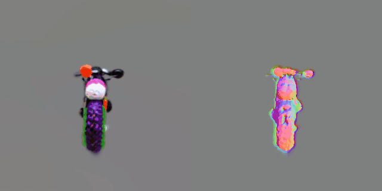
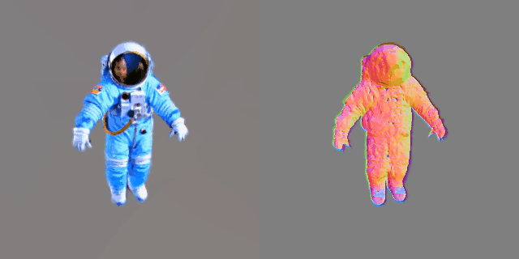
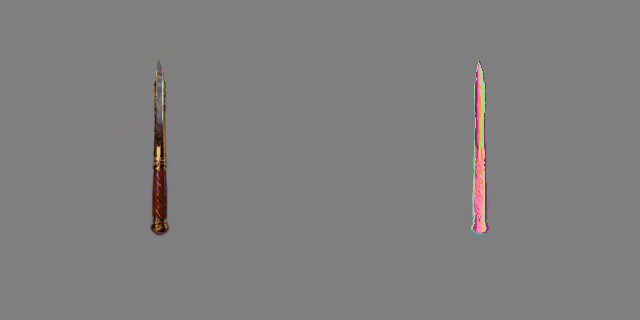
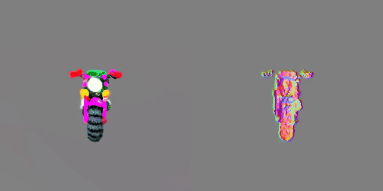
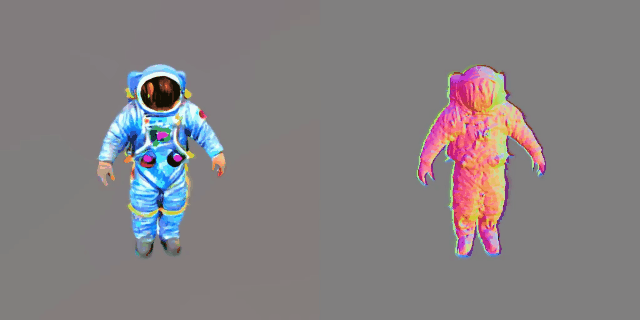
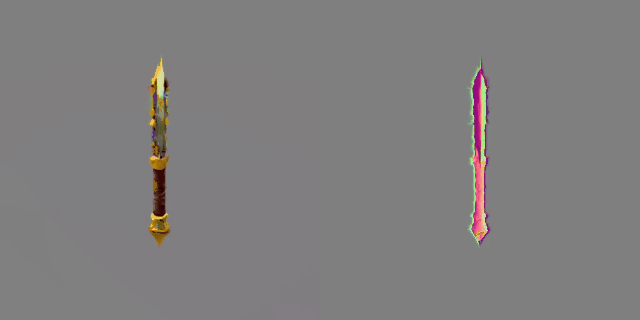

# threestudio-GaussianDreamer

<p align="center">
  
  
  
  <p align="center" style="margin-top: -20px">(a) Results guided by SD</p>
</p>

<p align="center">
  
  
  
  <p  align="center" style="margin-top: -20px">(b) Results guided by MVDream</p>
</p>


The [GaussianDreamer](https://github.com/hustvl/GaussianDreamer) extension for threestudio. This extension is writen by [Xinhua Cheng](https://github.com/cxh0519/). To use it, please install [threestudio](https://github.com/threestudio-project/threestudio) first and then install this extension in threestudio `custom` directory.

## 🔧Installation
```
cd custom
git clone https://github.com/cxh0519/threestudio-gaussiandreamer.git
cd threestudio-gaussiandreamer
git clone --recursive https://github.com/ashawkey/diff-gaussian-rasterization
git clone https://github.com/DSaurus/simple-knn.git
pip install ./diff-gaussian-rasterization
pip install ./simple-knn

pip install open3d
# If you want to export mesh, please install pymeshlab
pip install pymeshlab
```
Please also install [MVDream extension](https://github.com/DSaurus/threestudio-mvdream), [shap-e extension](https://github.com/DSaurus/threestudio-shap-e) and my version of [lrm extension](https://github.com/cxh0519/threestudio-lrm) in threestudio `custom` directory with their instructions.

## 🚀Quick Start
```
# SD2.1 + shap-e initialize
python launch.py --config custom/threestudio-gaussiandreamer/configs/gaussiandreamer.yaml  --train --gpu 0 system.prompt_processor.prompt="an amigurumi motorcycle" system.geometry.geometry_convert_from="shap-e:a motorcycle"

# MVDream + lrm initialize
python launch.py --config custom/threestudio-gaussiandreamer/configs/gaussiandreamer_mvdream.yaml  --train --gpu 0 system.prompt_processor.prompt="an astronaut wearing a blue suit" system.geometry.geometry_convert_from="lrm:an astronaut"
```
**[Notice]** Different 2D diffusion guidances (SD, MVDream) and initialize methods (shap-e, lrm) can be conbined arbitrarily.

## 📢Discussion

**Difference with Official GaussianDreamer** 

1. Slightly Hyper-pamarmeters differences.
2. Support MVDream as 2D guidance.
3. Support lrm initailzation.

**Difference with threestudio-3dgs**

1. Faster generation speed. (Around 10min on A100).
2. Add Grow&Pertb technique proposed by GaussianDreamer.
3. Support lrm+MVDream initailzation instead of lrm+SDXL.
Compared to SDXL, MVDream generates more appropriate front/side view images for given text prompt.


## 📌Citation
```
@article{GaussianDreamer,
    title={GaussianDreamer: Fast Generation from Text to 3D Gaussian Splatting with Point Cloud Priors},
    author={Taoran Yi and Jiemin Fang and Guanjun Wu and Lingxi Xie and Xiaopeng Zhang and Wenyu Liu and Qi Tian and Xinggang Wang},
    journal={arxiv:2310.08529},
    year={2023}
}
```